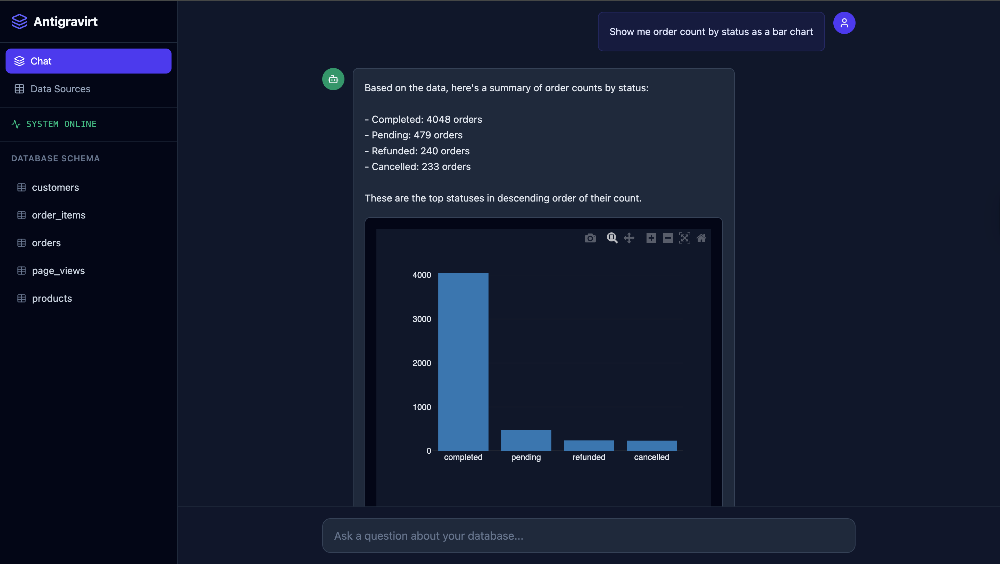
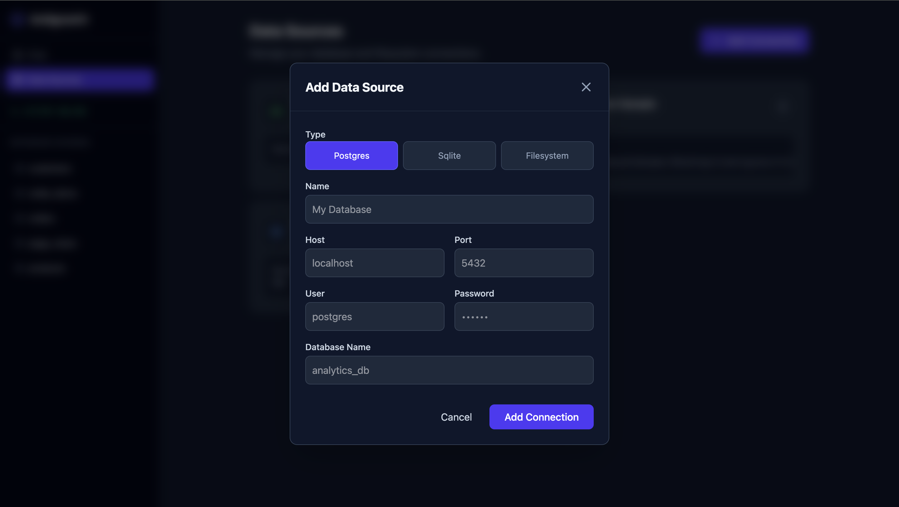
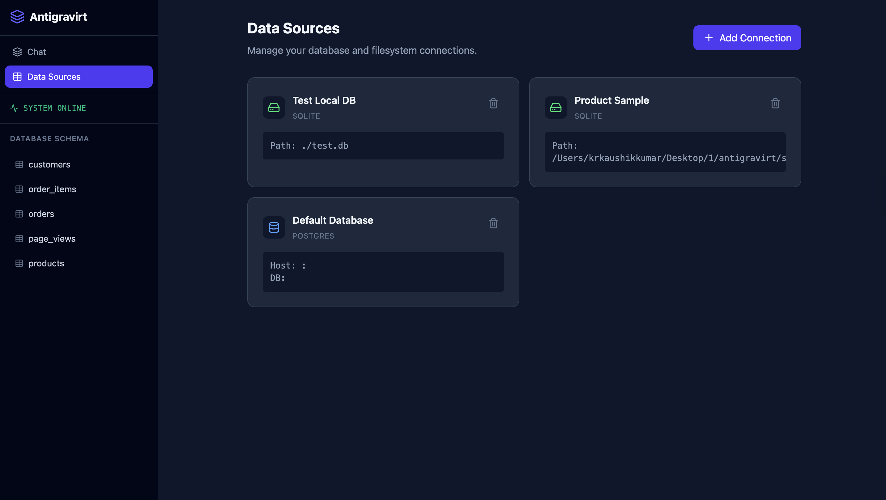
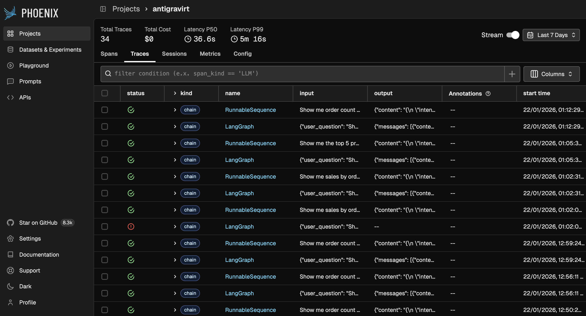
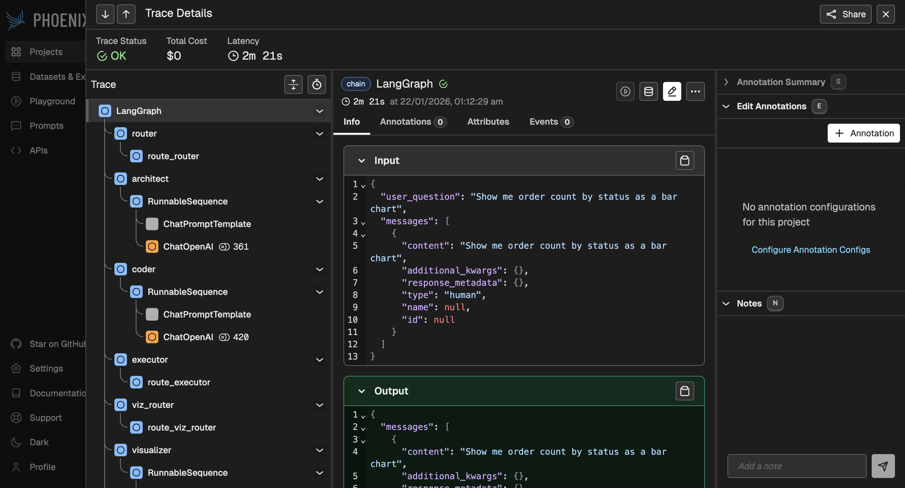
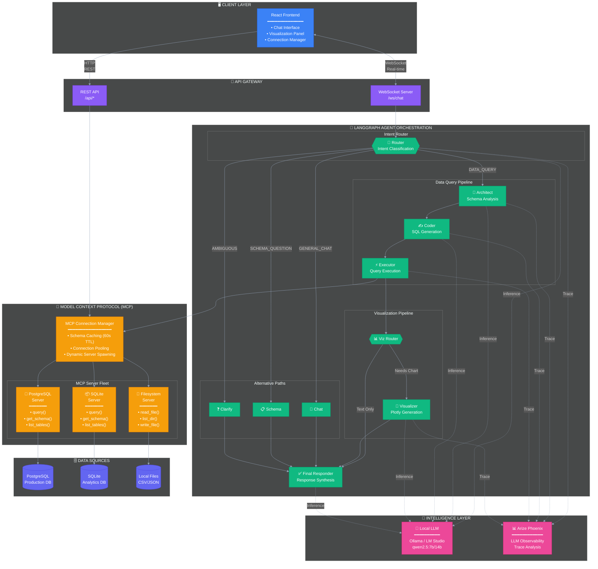
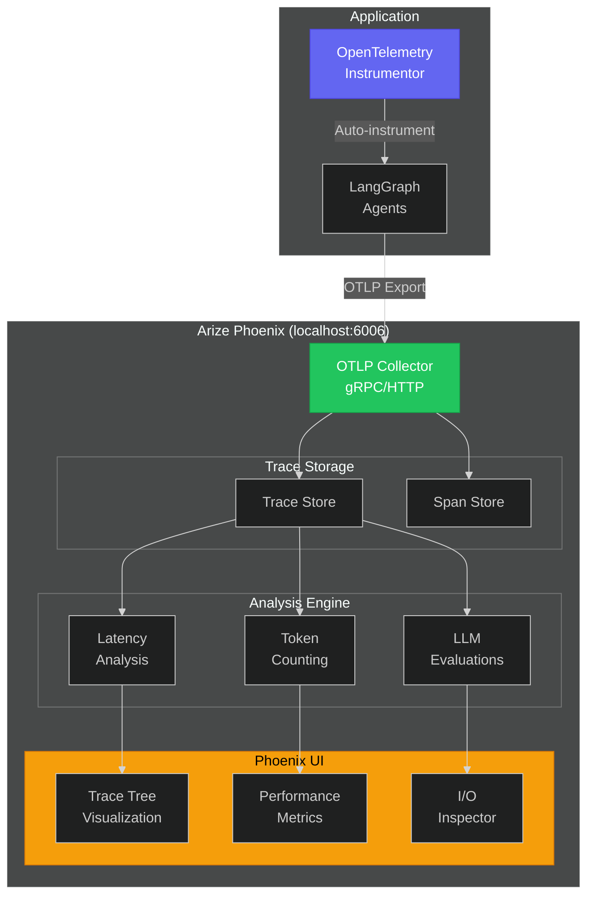
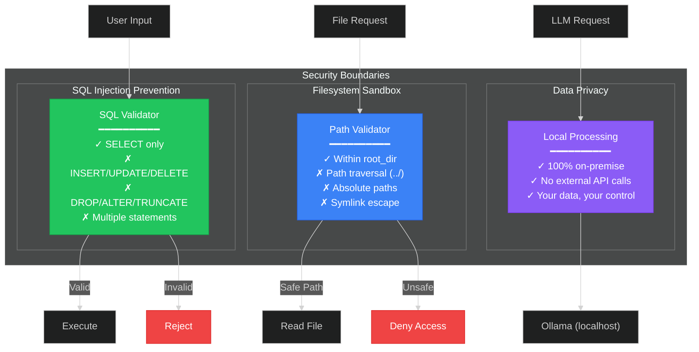

<p align="center">
  
  
  
  
</p>

# Antigravirt

**Antigravirt** is a privacy-first, local-running AI Data Analyst that transforms natural language questions into SQL queries, executes them against your databases, and visualizes the results — all without your data ever leaving your infrastructure.

<p align="center">
  
</p>

---

## ✨ Features

| Feature | Description |
|---------|-------------|
| 🗣️ **Natural Language to SQL** | Ask questions like "Show me monthly revenue" and get accurate SQL |
| 🔒 **Privacy First** | Runs 100% locally — your data never leaves your infrastructure |
| 📊 **Interactive Visualizations** | Auto-generates Plotly charts for data insights |
| 🔗 **Multi-Source Connectivity** | Connect multiple databases (PostgreSQL, SQLite) via MCP |
| 🤖 **Multi-Agent Architecture** | Powered by LangGraph for robust reasoning and self-correction |
| 🛡️ **Safe Execution** | Read-only permission model (SELECT only) prevents accidents |
| 📡 **Real-time Updates** | WebSocket streaming for live agent progress |
| 🔭 **Full Observability** | Arize Phoenix integration for LLM tracing |

---

## 🖼️ Screenshots

### Chat Interface with Visualization

The chat interface provides a natural conversation experience with inline visualizations:

<p align="center">
  
</p>

### Multi-Source Data Connectivity

Connect to multiple databases and data sources using the Model Context Protocol (MCP):

<p align="center">
  
</p>

<p align="center">
  
</p>

### LLM Observability with Arize Phoenix

Full visibility into your AI pipeline with trace analysis:

<p align="center">
  
</p>

<p align="center">
  
</p>

---

## 🛠️ Tech Stack

| Layer | Technologies |
|-------|--------------|
| **Backend** | Python 3.11, FastAPI, LangGraph, Pydantic, asyncpg |
| **Frontend** | React 18, TypeScript, Tailwind CSS, Plotly.js |
| **Database** | PostgreSQL 15, SQLite (via MCP) |
| **LLM** | Ollama, LM Studio, or Cloud APIs (OpenAI/Gemini) |
| **Protocol** | Model Context Protocol (MCP) for data connectivity |
| **Observability** | Arize Phoenix for LLM tracing |
| **Infrastructure** | Docker Compose |

---

## 🏗️ System Architecture

### Complete System Overview



---

### 🔗 MCP (Model Context Protocol) Deep Dive

The MCP layer provides a **unified interface** for connecting to heterogeneous data sources:

```mermaid
%%{init: {'theme': 'dark'}}%%
flowchart LR
    subgraph AGENT["Agent Layer"]
        EXEC["Executor Node"]
    end

    subgraph MCP_MANAGER["MCP Connection Manager"]
        direction TB
        CACHE["Schema Cache<br/>TTL: 60s"]
        REGISTRY["Connection Registry<br/>connections.json"]
        SPAWNER["Server Spawner<br/>subprocess.Popen"]
    end

    subgraph SERVERS["MCP Server Instances"]
        direction TB
        
        subgraph PG_SERVER["PostgreSQL MCP Server"]
            PG_QUERY["query(sql) → JSON"]
            PG_SCHEMA["get_schema() → DDL"]
            PG_TABLES["list_tables() → [str]"]
        end
        
        subgraph SQLITE_SERVER["SQLite MCP Server"]
            SQ_QUERY["query(sql) → JSON"]
            SQ_SCHEMA["get_schema() → DDL"]
            SQ_TABLES["list_tables() → [str]"]
        end
        
        subgraph FS_SERVER["Filesystem MCP Server"]
            FS_READ["read_file(path) → str"]
            FS_LIST["list_directory() → [str]"]
            FS_WRITE["write_file(path, data)"]
        end
    end

    subgraph TRANSPORT["stdio Transport"]
        STDIN["stdin (JSON-RPC)"]
        STDOUT["stdout (JSON-RPC)"]
    end

    EXEC -->|"get_tool_result()"| MCP_MANAGER
    MCP_MANAGER -->|"spawn if needed"| SERVERS
    SERVERS <-->|"JSON-RPC 2.0"| TRANSPORT

    style CACHE fill:#22c55e,stroke:#16a34a,color:#fff
    style REGISTRY fill:#3b82f6,stroke:#2563eb,color:#fff
    style SPAWNER fill:#f59e0b,stroke:#d97706,color:#fff
```



#### MCP Server Tools Reference

| Server | Tool | Input | Output | Description |
|--------|------|-------|--------|-------------|
| **PostgreSQL** | `query` | `sql: str` | `JSON` | Execute read-only SQL (SELECT only) |
| **PostgreSQL** | `get_schema` | `table_name?: str` | `DDL string` | Get table/column definitions |
| **PostgreSQL** | `list_tables` | — | `List[str]` | List all public tables |
| **SQLite** | `query` | `sql: str` | `JSON` | Execute read-only SQL |
| **SQLite** | `get_schema` | `table_name?: str` | `DDL string` | Get schema from sqlite_master |
| **SQLite** | `list_tables` | — | `List[str]` | List all tables |
| **Filesystem** | `read_file` | `path: str` | `str` | Read file (max 10MB, sandboxed) |
| **Filesystem** | `list_directory` | `path?: str` | `List[str]` | List directory contents |
| **Filesystem** | `write_file` | `path, data` | `bool` | Write to file (sandboxed) |

---

### 🔭 Arize Phoenix Observability Architecture

Full LLM observability with distributed tracing:



#### Trace Structure Example

```
📊 Query: "Show me sales by status as a bar chart"
│
├── 🧭 Router [12ms] ─────────────────────────────────────────────────
│   ├── Input:  "Show me sales by status as a bar chart"
│   ├── Output: {"intent": "DATA_QUERY", "confidence": 0.95}
│   └── Tokens: 156 in / 42 out
│
├── 📐 Architect [8ms] ───────────────────────────────────────────────
│   ├── Input:  Schema context + Question
│   ├── Output: {"tables": ["orders"], "strategy": "aggregate"}
│   └── Tokens: 892 in / 67 out
│
├── ✍️ Coder [15ms] ──────────────────────────────────────────────────
│   ├── Input:  Query strategy + Schema
│   ├── Output: "SELECT status, COUNT(*) FROM orders GROUP BY status"
│   └── Tokens: 1024 in / 89 out
│
├── ⚡ Executor [3ms] ─────────────────────────────────────────────────
│   ├── Input:  SQL Query
│   ├── Output: [{"status": "completed", "count": 156}, ...]
│   └── DB Latency: 2.1ms
│
├── 🎨 Visualizer [18ms] ─────────────────────────────────────────────
│   ├── Input:  Query result + Chart request
│   ├── Output: Plotly JSON specification
│   └── Tokens: 512 in / 234 out
│
└── ✅ Final Responder [11ms] ────────────────────────────────────────
    ├── Input:  Result + Visualization
    ├── Output: "Here is the sales breakdown by order status..."
    └── Tokens: 445 in / 112 out

Total: 67ms | Total Tokens: 3,573
```

#### Key Observability Metrics

| Metric | Description | Typical Value |
|--------|-------------|---------------|
| **Trace Duration** | End-to-end latency | 60-90s (local LLM) |
| **LLM Latency** | Per-inference time | 10-20s per call |
| **Token Usage** | Input + Output tokens | 2,000-5,000 per query |
| **MCP Latency** | Database query time | 1-50ms |
| **Error Rate** | Failed queries | < 5% |

---

### 🔐 Security Architecture



---

### 📊 Performance Characteristics

| Component | Latency | Throughput | Notes |
|-----------|---------|------------|-------|
| **WebSocket RTT** | < 5ms | 1000 msg/s | Real-time bidirectional |
| **Router Classification** | 10-15s | — | Local LLM inference |
| **SQL Generation** | 15-20s | — | Complex reasoning |
| **Query Execution** | 1-50ms | — | Depends on query complexity |
| **Visualization** | 10-15s | — | Plotly spec generation |
| **Schema Cache** | < 1ms | — | In-memory, 60s TTL |

> **Note:** Latencies shown are for local LLM (qwen2.5:7b). Cloud LLMs (GPT-4, Claude) reduce inference time to 1-3s per call.

---

## 📦 Project Structure

```
antigravirt/
├── backend/                 # FastAPI + LangGraph Agents
│   ├── agents/              # LangGraph nodes and prompts
│   │   ├── nodes/           # Router, Architect, Coder, Executor, etc.
│   │   ├── prompts/         # System prompts for each agent
│   │   ├── graph.py         # LangGraph workflow definition
│   │   └── llm.py           # LLM configuration (Ollama/OpenAI/Gemini)
│   ├── api/                 # FastAPI routes and WebSocket handlers
│   ├── mcp/                 # Model Context Protocol implementation
│   │   ├── manager.py       # Connection manager with caching
│   │   ├── servers/         # PostgreSQL, SQLite, Filesystem servers
│   │   └── tools.py         # MCP tool adapters
│   ├── observability/       # Arize Phoenix instrumentation
│   └── utils/               # Database and helper utilities
├── frontend/                # React Application
│   └── src/
│       ├── components/      # ChatPanel, Sidebar, ConnectionManager
│       ├── hooks/           # useWebSocket custom hook
│       └── types/           # TypeScript interfaces
├── infrastructure/          # Docker & Database Setup
│   ├── init.sql             # Database schema
│   └── docker-compose.yml   # PostgreSQL + Phoenix containers
├── img/                     # Documentation screenshots
│   ├── arize/               # Phoenix observability screenshots
│   └── system/              # UI screenshots
└── tests/                   # Test suite
```

---

## ⚡ Quick Start

### Prerequisites

- Python 3.11+
- Node.js 18+
- Docker & Docker Compose
- Ollama (recommended) or LM Studio

### Installation

```bash
# 1. Clone the repository
git clone https://github.com/kaushikkumarkr/Antigravit.git
cd antigravirt

# 2. Backend setup
python -m venv .venv
source .venv/bin/activate  # Windows: .venv\Scripts\activate
pip install -r requirements.txt

# 3. Environment configuration
cp .env.example .env
# Edit .env with your LLM and database settings

# 4. Start database (PostgreSQL)
docker-compose -f infrastructure/docker-compose.yml up -d

# 5. Seed sample data
python infrastructure/seed_data.py

# 6. Start Ollama with a model
ollama pull qwen2.5:7b
ollama serve

# 7. Start backend
uvicorn backend.main:app --reload --port 8000

# 8. Start frontend (new terminal)
cd frontend
npm install
npm run dev
```

### Access the Application

| Service | URL |
|---------|-----|
| **Frontend** | http://localhost:5173 |
| **Backend API** | http://localhost:8000 |
| **API Docs** | http://localhost:8000/docs |
| **Phoenix Observability** | http://localhost:6006 |

---

## 🔭 Observability with Arize Phoenix

Antigravirt includes built-in LLM observability using [Arize Phoenix](https://github.com/Arize-ai/phoenix).

### Features

- **Trace Tree Visualization** — See the full execution flow for each query
- **Token Usage Tracking** — Monitor input/output tokens per LLM call
- **Latency Analysis** — Identify slow nodes in your agent pipeline
- **LLM I/O Inspection** — View exact prompts and responses

### Trace Structure

Each query generates a trace tree:

```
Query: "Show me order count by status as a bar chart"
└── Router (LLM) → DATA_QUERY
    └── Architect (LLM) → [orders]
        └── Coder (LLM) → SQL Query
            └── Executor (MCP) → Query Result
                └── Viz Router → Needs Visualization
                    └── Visualizer (LLM) → Plotly Chart
                        └── Final Responder (LLM) → Answer
```

---

## 🔗 API Reference

### REST Endpoints

| Method | Endpoint | Description |
|--------|----------|-------------|
| `GET` | `/api/health` | Health check |
| `GET` | `/api/schema` | Get database schema from all connections |
| `POST` | `/api/query` | Execute a natural language query |
| `GET` | `/api/connections` | List all MCP connections |
| `POST` | `/api/connections` | Add a new data connection |
| `DELETE` | `/api/connections/{id}` | Remove a connection |

### WebSocket

```
ws://localhost:8000/ws/chat
```

**Message Format:**
```json
// Send
{"question": "How many customers are there?"}

// Receive (agent_update)
{"type": "agent_update", "payload": {"agent": "router", "status": "completed"}}

// Receive (final_response)
{"type": "final_response", "payload": {"answer": "...", "visualization": {...}}}
```

---

## 🧪 Example Queries

```
# Simple data queries
"How many customers are there?"
"What is the total revenue from all orders?"
"Show me the top 5 products by price"

# Visualization queries
"Show me order count by status as a bar chart"
"Show me sales distribution as a pie chart"

# Schema exploration
"What tables are in the database?"
"Describe the customers table"
```

---

## 🤝 Contributing

Contributions are welcome! Please read our contributing guidelines before submitting a pull request.

1. Fork the repository
2. Create your feature branch (`git checkout -b feature/amazing-feature`)
3. Commit your changes (`git commit -m 'Add amazing feature'`)
4. Push to the branch (`git push origin feature/amazing-feature`)
5. Open a Pull Request

---

## 📄 License

This project is licensed under the MIT License — see the [LICENSE](LICENSE) file for details.

---

<p align="center">
  Built with ❤️ by <a href="https://github.com/kaushikkumarkr">Kaushik Kumar</a>
</p>
