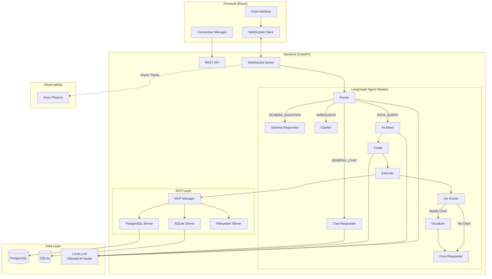

<p align="center">
  
  
  
  
</p>

# Antigravirt

**Antigravirt** is a privacy-first, local-running AI Data Analyst that transforms natural language questions into SQL queries, executes them against your databases, and visualizes the results — all without your data ever leaving your infrastructure.

<p align="center">
  
</p>

---

## ✨ Features

| Feature | Description |
|---------|-------------|
| 🗣️ **Natural Language to SQL** | Ask questions like "Show me monthly revenue" and get accurate SQL |
| 🔒 **Privacy First** | Runs 100% locally — your data never leaves your infrastructure |
| 📊 **Interactive Visualizations** | Auto-generates Plotly charts for data insights |
| 🔗 **Multi-Source Connectivity** | Connect multiple databases (PostgreSQL, SQLite) via MCP |
| 🤖 **Multi-Agent Architecture** | Powered by LangGraph for robust reasoning and self-correction |
| 🛡️ **Safe Execution** | Read-only permission model (SELECT only) prevents accidents |
| 📡 **Real-time Updates** | WebSocket streaming for live agent progress |
| 🔭 **Full Observability** | Arize Phoenix integration for LLM tracing |

---

## 🖼️ Screenshots

### Chat Interface with Visualization

The chat interface provides a natural conversation experience with inline visualizations:

<p align="center">
  
</p>

### Multi-Source Data Connectivity

Connect to multiple databases and data sources using the Model Context Protocol (MCP):

<p align="center">
  
</p>

<p align="center">
  
</p>

### LLM Observability with Arize Phoenix

Full visibility into your AI pipeline with trace analysis:

<p align="center">
  
</p>

<p align="center">
  
</p>

---

## 🛠️ Tech Stack

| Layer | Technologies |
|-------|--------------|
| **Backend** | Python 3.11, FastAPI, LangGraph, Pydantic, asyncpg |
| **Frontend** | React 18, TypeScript, Tailwind CSS, Plotly.js |
| **Database** | PostgreSQL 15, SQLite (via MCP) |
| **LLM** | Ollama, LM Studio, or Cloud APIs (OpenAI/Gemini) |
| **Protocol** | Model Context Protocol (MCP) for data connectivity |
| **Observability** | Arize Phoenix for LLM tracing |
| **Infrastructure** | Docker Compose |

---

## 🏗️ System Architecture

### High-Level Overview



### Agent Pipeline

| Agent | Responsibility |
|-------|----------------|
| **Router** | Classifies user intent (DATA_QUERY, SCHEMA_QUESTION, GENERAL_CHAT) |
| **Architect** | Identifies relevant tables and creates query strategy |
| **Coder** | Generates SQL based on schema and strategy |
| **Executor** | Runs SQL via MCP against the appropriate database |
| **Viz Router** | Determines if visualization is needed |
| **Visualizer** | Generates Plotly chart specifications |
| **Final Responder** | Converts results to natural language |

### Multi-Source Data Connectivity (MCP)

Antigravirt uses the **Model Context Protocol (MCP)** to connect to multiple data sources:

```
┌──────────────────────────────────────────────────────────────┐
│                     MCP Connection Manager                    │
├──────────────────────────────────────────────────────────────┤
│   ┌────────────────┐  ┌────────────────┐  ┌────────────────┐ │
│   │  PostgreSQL    │  │    SQLite      │  │   Filesystem   │ │
│   │    Server      │  │    Server      │  │     Server     │ │
│   └───────┬────────┘  └───────┬────────┘  └───────┬────────┘ │
│           │                   │                   │          │
│           ▼                   ▼                   ▼          │
│   ┌────────────────┐  ┌────────────────┐  ┌────────────────┐ │
│   │ Production DB  │  │  Local SQLite  │  │  Local Files   │ │
│   │    (Remote)    │  │   Databases    │  │   (Sandboxed)  │ │
│   └────────────────┘  └────────────────┘  └────────────────┘ │
└──────────────────────────────────────────────────────────────┘
```

**Supported Data Sources:**
- **PostgreSQL** — Production databases with full schema introspection
- **SQLite** — Local database files for development and analysis
- **Filesystem** — Sandboxed file access for CSV/JSON data (coming soon)

---

## 📦 Project Structure

```
antigravirt/
├── backend/                 # FastAPI + LangGraph Agents
│   ├── agents/              # LangGraph nodes and prompts
│   │   ├── nodes/           # Router, Architect, Coder, Executor, etc.
│   │   ├── prompts/         # System prompts for each agent
│   │   ├── graph.py         # LangGraph workflow definition
│   │   └── llm.py           # LLM configuration (Ollama/OpenAI/Gemini)
│   ├── api/                 # FastAPI routes and WebSocket handlers
│   ├── mcp/                 # Model Context Protocol implementation
│   │   ├── manager.py       # Connection manager with caching
│   │   ├── servers/         # PostgreSQL, SQLite, Filesystem servers
│   │   └── tools.py         # MCP tool adapters
│   ├── observability/       # Arize Phoenix instrumentation
│   └── utils/               # Database and helper utilities
├── frontend/                # React Application
│   └── src/
│       ├── components/      # ChatPanel, Sidebar, ConnectionManager
│       ├── hooks/           # useWebSocket custom hook
│       └── types/           # TypeScript interfaces
├── infrastructure/          # Docker & Database Setup
│   ├── init.sql             # Database schema
│   └── docker-compose.yml   # PostgreSQL + Phoenix containers
├── img/                     # Documentation screenshots
│   ├── arize/               # Phoenix observability screenshots
│   └── system/              # UI screenshots
└── tests/                   # Test suite
```

---

## ⚡ Quick Start

### Prerequisites

- Python 3.11+
- Node.js 18+
- Docker & Docker Compose
- Ollama (recommended) or LM Studio

### Installation

```bash
# 1. Clone the repository
git clone https://github.com/kaushikkumarkr/Antigravit.git
cd antigravirt

# 2. Backend setup
python -m venv .venv
source .venv/bin/activate  # Windows: .venv\Scripts\activate
pip install -r requirements.txt

# 3. Environment configuration
cp .env.example .env
# Edit .env with your LLM and database settings

# 4. Start database (PostgreSQL)
docker-compose -f infrastructure/docker-compose.yml up -d

# 5. Seed sample data
python infrastructure/seed_data.py

# 6. Start Ollama with a model
ollama pull qwen2.5:7b
ollama serve

# 7. Start backend
uvicorn backend.main:app --reload --port 8000

# 8. Start frontend (new terminal)
cd frontend
npm install
npm run dev
```

### Access the Application

| Service | URL |
|---------|-----|
| **Frontend** | http://localhost:5173 |
| **Backend API** | http://localhost:8000 |
| **API Docs** | http://localhost:8000/docs |
| **Phoenix Observability** | http://localhost:6006 |

---

## 🔭 Observability with Arize Phoenix

Antigravirt includes built-in LLM observability using [Arize Phoenix](https://github.com/Arize-ai/phoenix).

### Features

- **Trace Tree Visualization** — See the full execution flow for each query
- **Token Usage Tracking** — Monitor input/output tokens per LLM call
- **Latency Analysis** — Identify slow nodes in your agent pipeline
- **LLM I/O Inspection** — View exact prompts and responses

### Trace Structure

Each query generates a trace tree:

```
Query: "Show me order count by status as a bar chart"
└── Router (LLM) → DATA_QUERY
    └── Architect (LLM) → [orders]
        └── Coder (LLM) → SQL Query
            └── Executor (MCP) → Query Result
                └── Viz Router → Needs Visualization
                    └── Visualizer (LLM) → Plotly Chart
                        └── Final Responder (LLM) → Answer
```

---

## 🔗 API Reference

### REST Endpoints

| Method | Endpoint | Description |
|--------|----------|-------------|
| `GET` | `/api/health` | Health check |
| `GET` | `/api/schema` | Get database schema from all connections |
| `POST` | `/api/query` | Execute a natural language query |
| `GET` | `/api/connections` | List all MCP connections |
| `POST` | `/api/connections` | Add a new data connection |
| `DELETE` | `/api/connections/{id}` | Remove a connection |

### WebSocket

```
ws://localhost:8000/ws/chat
```

**Message Format:**
```json
// Send
{"question": "How many customers are there?"}

// Receive (agent_update)
{"type": "agent_update", "payload": {"agent": "router", "status": "completed"}}

// Receive (final_response)
{"type": "final_response", "payload": {"answer": "...", "visualization": {...}}}
```

---

## 🧪 Example Queries

```
# Simple data queries
"How many customers are there?"
"What is the total revenue from all orders?"
"Show me the top 5 products by price"

# Visualization queries
"Show me order count by status as a bar chart"
"Show me sales distribution as a pie chart"

# Schema exploration
"What tables are in the database?"
"Describe the customers table"
```

---

## 🤝 Contributing

Contributions are welcome! Please read our contributing guidelines before submitting a pull request.

1. Fork the repository
2. Create your feature branch (`git checkout -b feature/amazing-feature`)
3. Commit your changes (`git commit -m 'Add amazing feature'`)
4. Push to the branch (`git push origin feature/amazing-feature`)
5. Open a Pull Request

---

## 📄 License

This project is licensed under the MIT License — see the [LICENSE](LICENSE) file for details.

---

<p align="center">
  Built with ❤️ by <a href="https://github.com/kaushikkumarkr">Kaushik Kumar</a>
</p>
