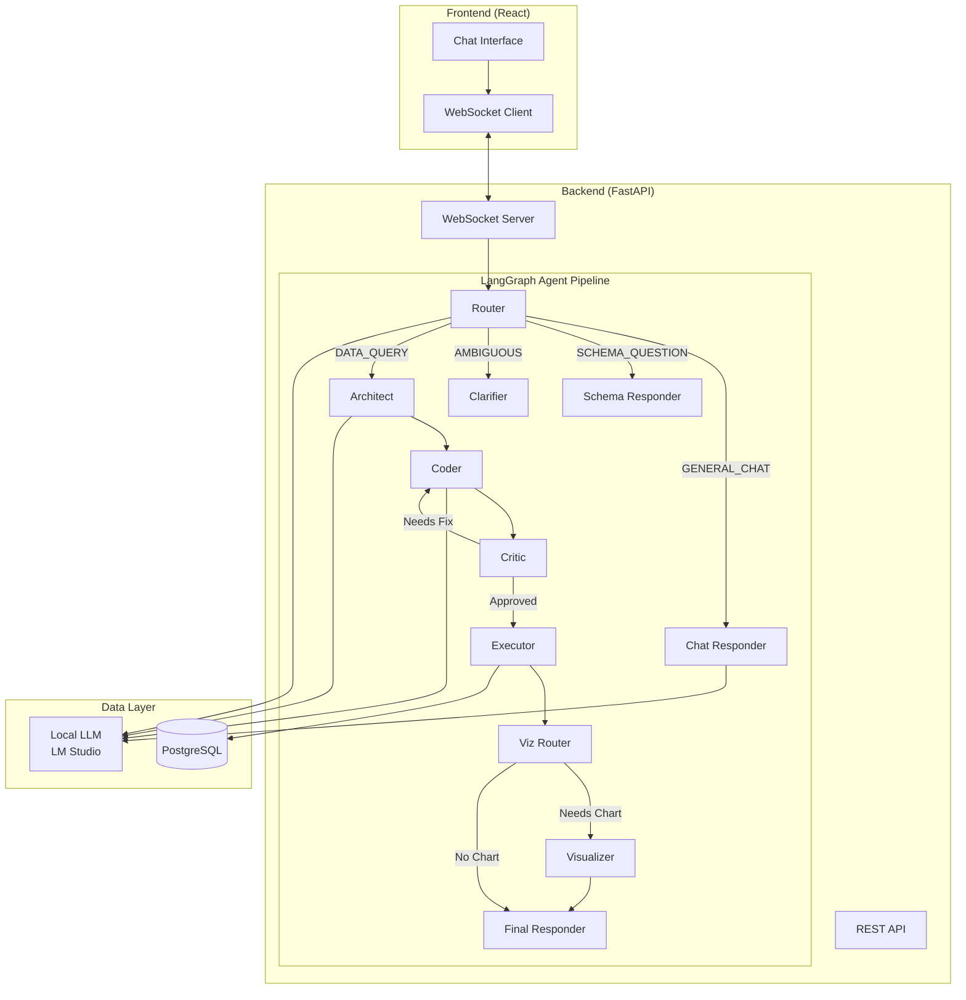

# Antigravirt

**Antigravirt** is a privacy-first, local-running AI Data Analyst that transforms natural language questions into SQL queries, executes them against your database, and visualizes the results.

## 🚀 Features

- **Natural Language to SQL**: Converts questions like "Show me monthly revenue" into safe SQL.
- **Privacy First**: Runs 100% locally. Your data never leaves your infrastructure.
- **Interactive Visualizations**: Automatically generates Plotly charts when appropriate.
- **Multi-Agent Architecture**: Powered by LangGraph for robust reasoning and self-correction.
- **Safe Execution**: Read-only permission model (SELECT only) to prevent accidents.

## 🛠️ Tech Stack

- **Backend**: Python 3.11, FastAPI, LangGraph, Pydantic
- **Frontend**: React, TypeScript, Tailwind CSS, Plotly.js
- **Database**: PostgreSQL 15 (via Docker)
- **LLM**: Local models via LM Studio (or Gemini/OpenAI as fallback)
- **Tooling**: Poetry, Docker Compose, MCP (Model Context Protocol)

## 📦 Project Structure

```
antigravirt/
├── backend/            # FastAPI + LangGraph Agents
│   ├── agents/         # LangGraph nodes and prompts
│   │   ├── nodes/      # Router, Architect, Coder, Executor, etc.
│   │   ├── prompts/    # System prompts for each agent
│   │   ├── graph.py    # LangGraph workflow definition
│   │   └── llm.py      # LLM configuration
│   ├── api/            # FastAPI routes and WebSocket
│   ├── mcp/            # Model Context Protocol server
│   └── utils/          # Database and helper utilities
├── frontend/           # React Application
│   └── src/
│       ├── components/ # UI components (ChatPanel, Sidebar)
│       └── hooks/      # Custom React hooks (useWebSocket)
├── infrastructure/     # Docker & Database Setup
│   ├── init.sql        # Database schema
│   └── seed_data.py    # Sample data generator
└── tests/              # Test Suite
```

## 🏗️ System Architecture

### High-Level Overview



### Agent Pipeline Flow

The system uses a **multi-agent architecture** powered by LangGraph. Each node has a specific responsibility:

| Agent | Role |
|-------|------|
| **Router** | Classifies user intent (DATA_QUERY, SCHEMA_QUESTION, GENERAL_CHAT, AMBIGUOUS) |
| **Architect** | Analyzes the question and creates a query plan |
| **Coder** | Generates SQL based on the architect's plan |
| **Critic** | Validates SQL syntax and safety (SELECT only) |
| **Executor** | Runs the SQL against PostgreSQL |
| **Viz Router** | Determines if visualization is needed |
| **Visualizer** | Generates Plotly chart specifications |
| **Final Responder** | Converts query results to natural language |

### Data Flow

```mermaid
sequenceDiagram
    participant U as User
    participant F as Frontend
    participant WS as WebSocket
    participant R as Router
    participant A as Agents
    participant DB as PostgreSQL
    participant LLM as Local LLM
    
    U->>F: "How many customers?"
    F->>WS: Send message
    WS->>R: Route intent
    R->>LLM: Classify intent
    LLM-->>R: DATA_QUERY
    R->>A: Architect → Coder → Critic → Executor
    A->>LLM: Generate SQL
    LLM-->>A: SELECT COUNT(*) FROM customers
    A->>DB: Execute query
    DB-->>A: 500
    A->>LLM: Format response
    LLM-->>A: "There are 500 customers"
    A-->>WS: Final response
    WS-->>F: Display answer
    F-->>U: "There are 500 customers"
```



### Key Design Decisions

1. **Privacy-First**: All processing happens locally. No data leaves your infrastructure.
2. **Read-Only Safety**: Only SELECT queries are allowed, preventing data modification.
3. **Self-Correcting**: The Critic agent validates SQL and requests fixes if needed.
4. **Streaming Updates**: WebSocket provides real-time agent status updates.
5. **Inline Visualizations**: Charts render directly in chat messages.


## ⚡ Quick Start

### Prerequisites
- Python 3.11+
- Node.js 18+
- Docker & Docker Compose
- LM Studio (recommended for local LLM)

### Setup

1. **Clone the repository:**
   ```bash
   git clone https://github.com/kaushikkumarkr/Antigravit.git
   cd antigravirt
   ```

2. **Backend Setup:**
   ```bash
   # Install dependencies
   pip install -r requirements.txt
   
   # Setup environment
   cp .env.example .env
   # Edit .env with your configuration
   ```

3. **Database Setup:**
   ```bash
   # Start Postgres
   docker-compose -f infrastructure/docker-compose.yml up -d
   ```

4. **Run Application:**
   ```bash
   # Start Backend
   uvicorn backend.main:app --reload
   ```

## 🤝 Contributing

Contributions are welcome! Please read `docs/CONTRIBUTING.md` (coming soon) for details.

## 📄 License

This project is licensed under the MIT License.
