<p align="center">
  
  
  
  
</p>

# Antigravirt

**Antigravirt** is a privacy-first, local-running AI Data Analyst that transforms natural language questions into SQL queries, executes them against your databases, and visualizes the results — all without your data ever leaving your infrastructure.

<p align="center">
  
</p>

---

## ✨ Features

| Feature | Description |
|---------|-------------|
| 🗣️ **Natural Language to SQL** | Ask questions like "Show me monthly revenue" and get accurate SQL |
| 🔒 **Privacy First** | Runs 100% locally — your data never leaves your infrastructure |
| 📊 **Interactive Visualizations** | Auto-generates Plotly charts for data insights |
| 🔗 **Multi-Source Connectivity** | Connect multiple databases (PostgreSQL, SQLite) via MCP |
| 🤖 **Multi-Agent Architecture** | Powered by LangGraph for robust reasoning and self-correction |
| 🛡️ **Safe Execution** | Read-only permission model (SELECT only) prevents accidents |
| 📡 **Real-time Updates** | WebSocket streaming for live agent progress |
| 🔭 **Full Observability** | Arize Phoenix integration for LLM tracing |

---

## 🖼️ Screenshots

### Chat Interface with Visualization

The chat interface provides a natural conversation experience with inline visualizations:

<p align="center">
  
</p>

### Multi-Source Data Connectivity

Connect to multiple databases and data sources using the Model Context Protocol (MCP):

<p align="center">
  
</p>

<p align="center">
  
</p>

### LLM Observability with Arize Phoenix

Full visibility into your AI pipeline with trace analysis:

<p align="center">
  
</p>

<p align="center">
  
</p>

---

## 🛠️ Tech Stack

| Layer | Technologies |
|-------|--------------|
| **Backend** | Python 3.11, FastAPI, LangGraph, Pydantic, asyncpg |
| **Frontend** | React 18, TypeScript, Tailwind CSS, Plotly.js |
| **Database** | PostgreSQL 15, SQLite (via MCP) |
| **LLM** | Ollama, LM Studio, or Cloud APIs (OpenAI/Gemini) |
| **Protocol** | Model Context Protocol (MCP) for data connectivity |
| **Observability** | Arize Phoenix for LLM tracing |
| **Infrastructure** | Docker Compose |

---

## 🏗️ System Architecture

### Architecture Overview

Antigravirt follows a **layered architecture** with clear separation of concerns:

```
┌─────────────────────────────────────────────────────────────────────────────┐
│                           PRESENTATION LAYER                                 │
│  ┌─────────────────────────────────────────────────────────────────────────┐ │
│  │                         React Frontend                                   │ │
│  │   ┌──────────────┐  ┌──────────────┐  ┌──────────────────────────────┐  │ │
│  │   │ Chat Panel   │  │   Sidebar    │  │   Connection Manager         │  │ │
│  │   │  - Messages  │  │  - Schema    │  │   - Add/Remove Sources       │  │ │
│  │   │  - Charts    │  │  - Status    │  │   - PostgreSQL/SQLite/FS     │  │ │
│  │   └──────────────┘  └──────────────┘  └──────────────────────────────┘  │ │
│  └─────────────────────────────────────────────────────────────────────────┘ │
│                                    │ WebSocket + REST API                    │
└────────────────────────────────────┼────────────────────────────────────────┘
                                     ▼
┌─────────────────────────────────────────────────────────────────────────────┐
│                           APPLICATION LAYER                                  │
│  ┌─────────────────────────────────────────────────────────────────────────┐ │
│  │                         FastAPI Backend                                  │ │
│  │   ┌─────────────────────────────────────────────────────────────────┐   │ │
│  │   │                  LangGraph Agent Pipeline                        │   │ │
│  │   │                                                                  │   │ │
│  │   │   ┌─────────┐     ┌───────────┐     ┌────────┐     ┌─────────┐  │   │ │
│  │   │   │ Router  │────▶│ Architect │────▶│ Coder  │────▶│Executor │  │   │ │
│  │   │   └────┬────┘     └───────────┘     └────────┘     └────┬────┘  │   │ │
│  │   │        │                                                 │       │   │ │
│  │   │   ┌────▼────┐                                      ┌────▼────┐  │   │ │
│  │   │   │  Chat   │                                      │Viz Route│  │   │ │
│  │   │   │Responder│                                      └────┬────┘  │   │ │
│  │   │   └─────────┘                                           │       │   │ │
│  │   │                                                    ┌────▼────┐  │   │ │
│  │   │                                                    │Visualizr│  │   │ │
│  │   │                                                    └────┬────┘  │   │ │
│  │   │                                                         ▼       │   │ │
│  │   │                                                  ┌───────────┐  │   │ │
│  │   │                                                  │  Final    │  │   │ │
│  │   │                                                  │ Responder │  │   │ │
│  │   │                                                  └───────────┘  │   │ │
│  │   └─────────────────────────────────────────────────────────────────┘   │ │
│  └─────────────────────────────────────────────────────────────────────────┘ │
│                                    │                                         │
└────────────────────────────────────┼────────────────────────────────────────┘
                                     ▼
┌─────────────────────────────────────────────────────────────────────────────┐
│                         DATA CONNECTIVITY LAYER (MCP)                        │
│  ┌─────────────────────────────────────────────────────────────────────────┐ │
│  │                       MCP Connection Manager                             │ │
│  │   ┌────────────────┐  ┌────────────────┐  ┌────────────────────────┐    │ │
│  │   │ PostgreSQL     │  │    SQLite      │  │     Filesystem         │    │ │
│  │   │    Server      │  │    Server      │  │       Server           │    │ │
│  │   │                │  │                │  │                        │    │ │
│  │   │ • query()      │  │ • query()      │  │ • read_file()          │    │ │
│  │   │ • get_schema() │  │ • get_schema() │  │ • list_directory()     │    │ │
│  │   │ • list_tables()│  │ • list_tables()│  │ • write_file()         │    │ │
│  │   └───────┬────────┘  └───────┬────────┘  └───────────┬────────────┘    │ │
│  └───────────┼───────────────────┼───────────────────────┼─────────────────┘ │
└──────────────┼───────────────────┼───────────────────────┼──────────────────┘
               ▼                   ▼                       ▼
┌─────────────────────────────────────────────────────────────────────────────┐
│                             DATA LAYER                                       │
│                                                                              │
│   ┌────────────────┐     ┌────────────────┐     ┌────────────────────────┐  │
│   │   PostgreSQL   │     │    SQLite      │     │   Local Filesystem     │  │
│   │   Database(s)  │     │   Database(s)  │     │   (Sandboxed)          │  │
│   └────────────────┘     └────────────────┘     └────────────────────────┘  │
│                                                                              │
└─────────────────────────────────────────────────────────────────────────────┘
                                     │
                                     ▼
┌─────────────────────────────────────────────────────────────────────────────┐
│                          INTELLIGENCE LAYER                                  │
│                                                                              │
│   ┌───────────────────────────────────────┐   ┌───────────────────────────┐ │
│   │          Local LLM (Ollama)           │   │    Arize Phoenix          │ │
│   │                                       │   │    (Observability)        │ │
│   │   • qwen2.5:7b / qwen2.5:14b         │   │                           │ │
│   │   • 100% Local Processing            │   │   • Trace Visualization   │ │
│   │   • No Data Leaves Infrastructure    │   │   • Token Usage Tracking  │ │
│   │                                       │   │   • Latency Analysis      │ │
│   └───────────────────────────────────────┘   └───────────────────────────┘ │
│                                                                              │
└─────────────────────────────────────────────────────────────────────────────┘
```

### Agent Pipeline (LangGraph)

```mermaid
flowchart LR
    subgraph INPUT
        Q[/"User Question"/]
    end

    subgraph ROUTING["🧭 Intent Classification"]
        R{Router}
    end

    subgraph DATA_PATH["📊 Data Query Path"]
        A[Architect<br/>Identify Tables]
        C[Coder<br/>Generate SQL]
        E[Executor<br/>Run Query]
        VR{Viz Router}
        V[Visualizer<br/>Create Chart]
    end

    subgraph OTHER_PATHS["💬 Alternative Paths"]
        CR[Chat Responder]
        SR[Schema Responder]
        CL[Clarifier]
    end

    subgraph OUTPUT
        FR[Final Responder]
        O[/"Response + Chart"/]
    end

    Q --> R
    R -->|DATA_QUERY| A
    R -->|GENERAL_CHAT| CR
    R -->|SCHEMA_QUESTION| SR
    R -->|AMBIGUOUS| CL

    A --> C --> E --> VR
    VR -->|Needs Chart| V
    VR -->|Text Only| FR
    V --> FR
    
    CR --> O
    SR --> O
    CL --> O
    FR --> O

    style R fill:#6366f1,stroke:#4f46e5,color:#fff
    style A fill:#10b981,stroke:#059669,color:#fff
    style C fill:#f59e0b,stroke:#d97706,color:#fff
    style E fill:#ef4444,stroke:#dc2626,color:#fff
    style V fill:#8b5cf6,stroke:#7c3aed,color:#fff
    style FR fill:#3b82f6,stroke:#2563eb,color:#fff
```



### Component Responsibilities

| Component | Layer | Responsibility |
|-----------|-------|----------------|
| **Chat Panel** | Presentation | Display messages, charts, handle user input |
| **Connection Manager** | Presentation | Configure data source connections |
| **WebSocket Server** | Application | Real-time bidirectional communication |
| **Router** | Application | Classify user intent with confidence scoring |
| **Architect** | Application | Analyze schema, identify relevant tables |
| **Coder** | Application | Generate safe, optimized SQL queries |
| **Executor** | Application | Execute SQL via MCP, format results |
| **Visualizer** | Application | Generate Plotly chart specifications |
| **MCP Manager** | Data | Manage connections, cache schemas |
| **PostgreSQL Server** | Data | Execute queries against PostgreSQL |
| **SQLite Server** | Data | Execute queries against SQLite |
| **Ollama/LM Studio** | Intelligence | Local LLM inference |
| **Arize Phoenix** | Intelligence | LLM observability and tracing |

### Data Flow Sequence

```mermaid
sequenceDiagram
    autonumber
    participant U as 👤 User
    participant F as 🖥️ Frontend
    participant WS as 🔌 WebSocket
    participant R as 🧭 Router
    participant A as 📐 Architect
    participant C as ✍️ Coder
    participant MCP as 🔗 MCP
    participant DB as 🗄️ Database
    participant LLM as 🤖 LLM
    participant P as 📊 Phoenix

    U->>F: "Show sales by status as a chart"
    F->>WS: Send message
    
    rect rgb(99, 102, 241, 0.1)
        Note over WS,R: Intent Classification
        WS->>R: Route request
        R->>LLM: Classify intent
        LLM-->>R: DATA_QUERY (0.95)
        R-)P: Log trace
    end

    rect rgb(16, 185, 129, 0.1)
        Note over R,C: Query Generation
        R->>A: Schema analysis
        A->>LLM: Identify tables
        LLM-->>A: [orders]
        A->>C: Generate SQL
        C->>LLM: Create query
        LLM-->>C: SELECT status, COUNT(*)...
    end

    rect rgb(239, 68, 68, 0.1)
        Note over C,DB: Query Execution
        C->>MCP: Execute query
        MCP->>DB: Run SQL
        DB-->>MCP: Results
        MCP-->>C: Formatted data
    end

    rect rgb(139, 92, 246, 0.1)
        Note over C,F: Response Generation
        C->>LLM: Generate chart + response
        LLM-->>C: Plotly spec + text
        C->>WS: Final response
        WS->>F: Display result
        F->>U: Show chart + answer
    end
```



### Security Model

```
┌─────────────────────────────────────────────────────────────────┐
│                      SECURITY BOUNDARIES                         │
├─────────────────────────────────────────────────────────────────┤
│                                                                  │
│  ┌──────────────────────────────────────────────────────────┐   │
│  │                   READ-ONLY ENFORCEMENT                   │   │
│  │                                                           │   │
│  │   ✓ SELECT queries only                                  │   │
│  │   ✗ INSERT, UPDATE, DELETE blocked                       │   │
│  │   ✗ DROP, ALTER, TRUNCATE blocked                        │   │
│  │   ✗ Multiple statements blocked                          │   │
│  │                                                           │   │
│  └──────────────────────────────────────────────────────────┘   │
│                                                                  │
│  ┌──────────────────────────────────────────────────────────┐   │
│  │                   FILESYSTEM SANDBOXING                   │   │
│  │                                                           │   │
│  │   ✓ Access limited to specified root directory           │   │
│  │   ✗ Path traversal (../) blocked                         │   │
│  │   ✗ Absolute paths outside sandbox blocked               │   │
│  │                                                           │   │
│  └──────────────────────────────────────────────────────────┘   │
│                                                                  │
│  ┌──────────────────────────────────────────────────────────┐   │
│  │                   LOCAL PROCESSING                        │   │
│  │                                                           │   │
│  │   ✓ All LLM inference runs locally (Ollama)              │   │
│  │   ✓ No data sent to external APIs                        │   │
│  │   ✓ Full control over data residency                     │   │
│  │                                                           │   │
│  └──────────────────────────────────────────────────────────┘   │
│                                                                  │
└─────────────────────────────────────────────────────────────────┘
```

---

## 📦 Project Structure

```
antigravirt/
├── backend/                 # FastAPI + LangGraph Agents
│   ├── agents/              # LangGraph nodes and prompts
│   │   ├── nodes/           # Router, Architect, Coder, Executor, etc.
│   │   ├── prompts/         # System prompts for each agent
│   │   ├── graph.py         # LangGraph workflow definition
│   │   └── llm.py           # LLM configuration (Ollama/OpenAI/Gemini)
│   ├── api/                 # FastAPI routes and WebSocket handlers
│   ├── mcp/                 # Model Context Protocol implementation
│   │   ├── manager.py       # Connection manager with caching
│   │   ├── servers/         # PostgreSQL, SQLite, Filesystem servers
│   │   └── tools.py         # MCP tool adapters
│   ├── observability/       # Arize Phoenix instrumentation
│   └── utils/               # Database and helper utilities
├── frontend/                # React Application
│   └── src/
│       ├── components/      # ChatPanel, Sidebar, ConnectionManager
│       ├── hooks/           # useWebSocket custom hook
│       └── types/           # TypeScript interfaces
├── infrastructure/          # Docker & Database Setup
│   ├── init.sql             # Database schema
│   └── docker-compose.yml   # PostgreSQL + Phoenix containers
├── img/                     # Documentation screenshots
│   ├── arize/               # Phoenix observability screenshots
│   └── system/              # UI screenshots
└── tests/                   # Test suite
```

---

## ⚡ Quick Start

### Prerequisites

- Python 3.11+
- Node.js 18+
- Docker & Docker Compose
- Ollama (recommended) or LM Studio

### Installation

```bash
# 1. Clone the repository
git clone https://github.com/kaushikkumarkr/Antigravit.git
cd antigravirt

# 2. Backend setup
python -m venv .venv
source .venv/bin/activate  # Windows: .venv\Scripts\activate
pip install -r requirements.txt

# 3. Environment configuration
cp .env.example .env
# Edit .env with your LLM and database settings

# 4. Start database (PostgreSQL)
docker-compose -f infrastructure/docker-compose.yml up -d

# 5. Seed sample data
python infrastructure/seed_data.py

# 6. Start Ollama with a model
ollama pull qwen2.5:7b
ollama serve

# 7. Start backend
uvicorn backend.main:app --reload --port 8000

# 8. Start frontend (new terminal)
cd frontend
npm install
npm run dev
```

### Access the Application

| Service | URL |
|---------|-----|
| **Frontend** | http://localhost:5173 |
| **Backend API** | http://localhost:8000 |
| **API Docs** | http://localhost:8000/docs |
| **Phoenix Observability** | http://localhost:6006 |

---

## 🔭 Observability with Arize Phoenix

Antigravirt includes built-in LLM observability using [Arize Phoenix](https://github.com/Arize-ai/phoenix).

### Features

- **Trace Tree Visualization** — See the full execution flow for each query
- **Token Usage Tracking** — Monitor input/output tokens per LLM call
- **Latency Analysis** — Identify slow nodes in your agent pipeline
- **LLM I/O Inspection** — View exact prompts and responses

### Trace Structure

Each query generates a trace tree:

```
Query: "Show me order count by status as a bar chart"
└── Router (LLM) → DATA_QUERY
    └── Architect (LLM) → [orders]
        └── Coder (LLM) → SQL Query
            └── Executor (MCP) → Query Result
                └── Viz Router → Needs Visualization
                    └── Visualizer (LLM) → Plotly Chart
                        └── Final Responder (LLM) → Answer
```

---

## 🔗 API Reference

### REST Endpoints

| Method | Endpoint | Description |
|--------|----------|-------------|
| `GET` | `/api/health` | Health check |
| `GET` | `/api/schema` | Get database schema from all connections |
| `POST` | `/api/query` | Execute a natural language query |
| `GET` | `/api/connections` | List all MCP connections |
| `POST` | `/api/connections` | Add a new data connection |
| `DELETE` | `/api/connections/{id}` | Remove a connection |

### WebSocket

```
ws://localhost:8000/ws/chat
```

**Message Format:**
```json
// Send
{"question": "How many customers are there?"}

// Receive (agent_update)
{"type": "agent_update", "payload": {"agent": "router", "status": "completed"}}

// Receive (final_response)
{"type": "final_response", "payload": {"answer": "...", "visualization": {...}}}
```

---

## 🧪 Example Queries

```
# Simple data queries
"How many customers are there?"
"What is the total revenue from all orders?"
"Show me the top 5 products by price"

# Visualization queries
"Show me order count by status as a bar chart"
"Show me sales distribution as a pie chart"

# Schema exploration
"What tables are in the database?"
"Describe the customers table"
```

---

## 🤝 Contributing

Contributions are welcome! Please read our contributing guidelines before submitting a pull request.

1. Fork the repository
2. Create your feature branch (`git checkout -b feature/amazing-feature`)
3. Commit your changes (`git commit -m 'Add amazing feature'`)
4. Push to the branch (`git push origin feature/amazing-feature`)
5. Open a Pull Request

---

## 📄 License

This project is licensed under the MIT License — see the [LICENSE](LICENSE) file for details.

---

<p align="center">
  Built with ❤️ by <a href="https://github.com/kaushikkumarkr">Kaushik Kumar</a>
</p>
